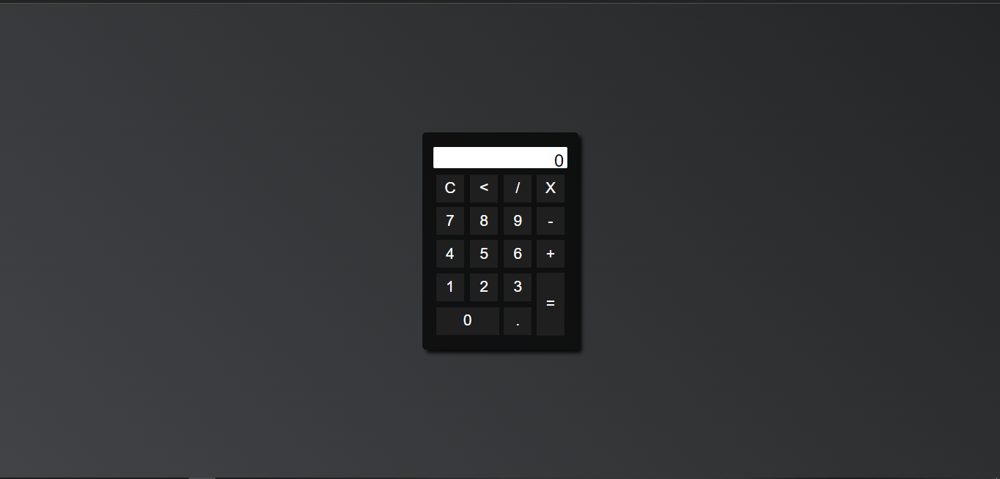
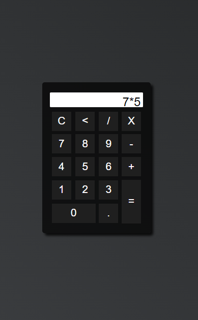
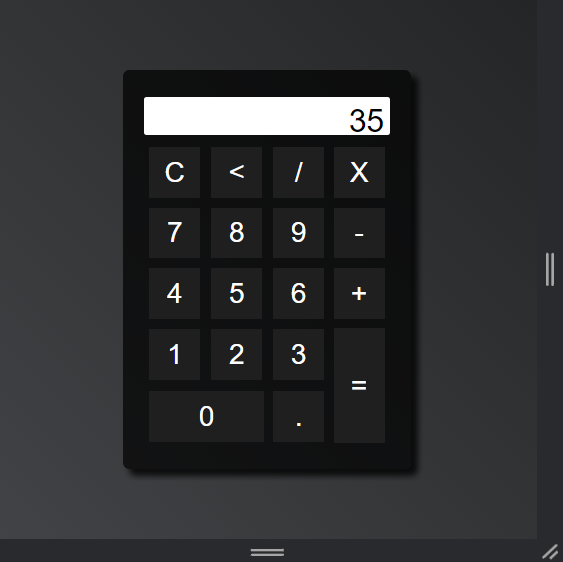

<h1 align="center"> calculadora </h1>

## 🚀 Tecnologias utilizadas

- HTML
- CSS
- JavaScript

## 💻 Sobre o Projeto
 Esse projeto é uma calculadora que pode fazer qualquer operação matemática básica!
 
 Tendo um layout bonito e reponsivo, e toda uma lógica aplicada com JavaScript.
 

## Images do projeto
Desktop
  
     
     
Mobile
  
     

Mobile
  
     

By Diego Silva 
